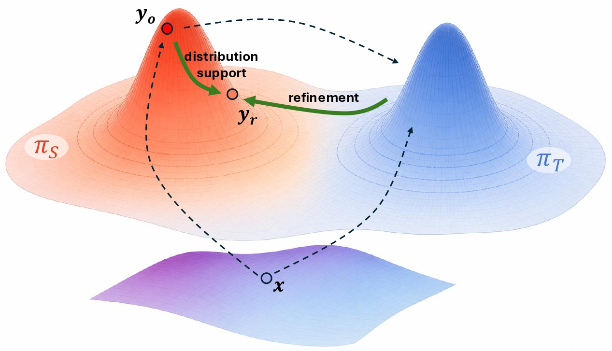

# Trajectory-Refined Distillation

[](https://arxiv.org/abs/2606.08432)
[](#)
[](LICENSE)

**Authors:** Li Jiang, Haoran Xu, Yichuan Ding, Amy Zhang

Trajectory-Refined Distillation (TRD) addresses prefix failure in on-policy distillation by revising student rollouts $y_o$ under teacher guidance before KL training. It moves beyond token-level loss interventions to trajectory-level output refinement resulting the TRD refined target $y_r$ (ours), and can be applied to both OPD and OPSD training. This repository provides the cleaned TRD training code, task wrappers, and math/code evaluation recipes needed to reproduce KL training on top of `verl`.

<p align="center">
  
</p>

## What Is Included

- `recipe/opd/`: OPD/OPSD trainer, KL losses, data preparation, rollout preparation, and run wrappers.
- `recipe/opd/run/run_kl_training.sh`: training entrypoint.
- `recipe/opd/run/opd/{code,math}/$MODEL/*.sh`: OPD wrappers.
- `recipe/opd/run/opsd/{code,math}/$MODEL/*.sh`: OPSD wrappers.
- `recipe/math_evaluation/`: math benchmark runner and dataset preparation utilities.
- `recipe/code_evaluation/`: code benchmark runner, EvalPlus/LiveCodeBench helpers, and local LiveCodeBench copy.
- `verl/`: the underlying training/generation runtime used by the OPD recipe.

## Environment

Follow the official [verl installation guide](https://verl.readthedocs.io/en/latest/start/install.html) for the CUDA, PyTorch, Ray, vLLM, Transformers, and other runtime dependencies. After the `verl` environment is ready, install this repository in editable mode:

```bash
pip install -e .
```

For code evaluation, also install EvalPlus and the bundled LiveCodeBench runner:

```bash
python -m pip install --upgrade "evalplus[vllm] @ git+https://github.com/evalplus/evalplus"
python -m pip install -e recipe/code_evaluation/external/LiveCodeBench
export LCB_REPO=$PWD/recipe/code_evaluation/external/LiveCodeBench
```

## Dataset Preparation

Set the local data root once, then prepare the fixed training and evaluation datasets with the provided scripts.

```bash
export DATA_ROOT=$PWD/data
export TRAIN_DATA_PATH=$DATA_ROOT/train/DeepScaleR      # math training
export CODE_TRAIN_DATA_PATH=$DATA_ROOT/train/TACO       # code training
export EVAL_DATASETS_DIR=$DATA_ROOT/eval

mkdir -p "$DATA_ROOT/train" "$EVAL_DATASETS_DIR"

# Math training dataset: agentica-org/DeepScaleR-Preview-Dataset
python recipe/opd/dataset/prepare_deepscaler.py \
  --output_dir "$TRAIN_DATA_PATH"

# Code training dataset: BAAI/TACO
python recipe/opd/dataset/prepare_taco.py \
  --output_dir "$CODE_TRAIN_DATA_PATH"

# Math evaluation datasets
python recipe/math_evaluation/datasets/prepare_aime.py \
  --local_save_dir "$EVAL_DATASETS_DIR"
python recipe/math_evaluation/datasets/prepare_hmmt.py \
  --local_dataset_path "$EVAL_DATASETS_DIR"
python recipe/math_evaluation/datasets/prepare_additional_eval_datasets.py \
  --datasets beyondaime,amobench \
  --local_save_dir "$EVAL_DATASETS_DIR"
```

For code wrappers, set `TRAIN_DATA_PATH=$CODE_TRAIN_DATA_PATH` before launching.

## Run Training

Each wrapper sets the task, model family, KL variant, y-mode, and length budgets, then calls `recipe/opd/run/run_kl_training.sh`.

Examples:

```bash
export DATA_ROOT=$PWD/data
export EVAL_DATASETS_DIR=$DATA_ROOT/eval

# OPD code, Qwen3-1.7B, reverse KL + top-k
export TRAIN_DATA_PATH=$DATA_ROOT/train/TACO
bash recipe/opd/run/opd/code/qwen3-1.7B/reverse_kl_topk.sh

# OPD math, Qwen3-4B-Instruct, forward KL on TRD refined target y_r (ours)
export TRAIN_DATA_PATH=$DATA_ROOT/train/DeepScaleR
bash recipe/opd/run/opd/math/qwen3-4b-instruct/forward_kl_y_r.sh

# OPSD math, teacher equals student
export TRAIN_DATA_PATH=$DATA_ROOT/train/DeepScaleR
bash recipe/opd/run/opsd/math/qwen3-1.7B/forward_kl_clip.sh
```

Available variants under every model directory:

- `forward_kl.sh`: forward KL on `y_o`.
- `forward_kl_y_r.sh`: forward KL on the TRD refined target `y_r` (ours).
- `forward_kl_clip.sh`: forward KL on `y_o` with token-level KL clipping.
- `reverse_kl.sh`: reverse KL on `y_o`.
- `reverse_kl_topk.sh`: reverse KL on `y_o` with teacher top-k support.

## Evaluation

Training wrappers can run final evaluation automatically with `RUN_EVAL_AFTER_TRAINING=true` (default). To skip evaluation:

```bash
export RUN_EVAL_AFTER_TRAINING=false
```

To evaluate an existing model manually:

```bash
export DATA_ROOT=$PWD/data

# Math
EVAL_DATASETS_DIR=$DATA_ROOT/eval \
DATASETS="aime24,aime25,hmmt25,beyondaime,amobench" \
bash recipe/math_evaluation/benchmark_kl_model.sh /path/to/hf_merged

# Code
DATASETS="humaneval_plus,mbpp_plus,livecodebench_v6" \
bash recipe/code_evaluation/benchmark_code_model.sh /path/to/hf_merged
```

## Citation

If you find this work useful, please cite:

```bibtex
@article{jiang2026trajectory,
  title={Trajectory-Refined Distillation},
  author={Jiang, Li and Xu, Haoran and Ding, Yichuan and Zhang, Amy},
  journal={arXiv preprint},
  year={2026},
  note={Coming soon}
}
```
